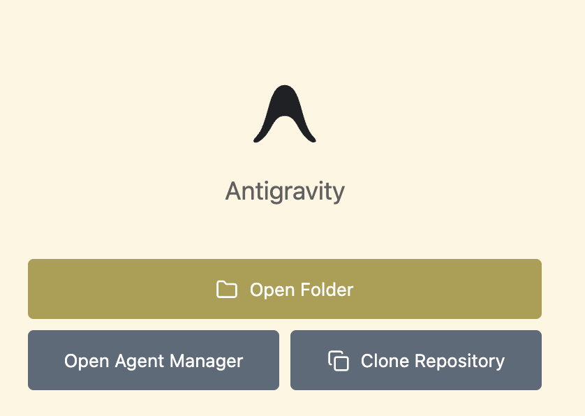
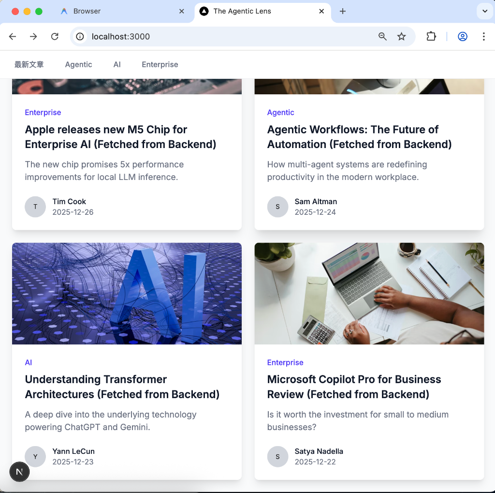

# The Agentic Lens

[English](README.md) | [繁體中文](README.zh-TW.md)

---

# 🚀 Get Started with Google Antigravity

1. 開啟 **Google Antigravity**。
2. 在啟動器中點擊 **Clone Repository**。
   
3. 複製並貼上專案連結：
   `https://github.com/jimmyliao/lab-agy`
4. 按下 **Enter** 鍵即可開始 Vibe Coding。

---

## 概覽
一個現代化的新聞平台，展示代理式 AI (Agentic AI) 與企業級解決方案的最新動態。

## 系統架構
- **前端網頁**: Next.js
- **API 後端**: FastAPI
- **資料存儲**: PostgreSQL 與 Milvus (向量資料庫)

## 快速開始
1. 安裝 Docker 與 Docker Compose。
2. 執行 `docker-compose up -d`。
3. 瀏覽 `http://localhost:3000`。

## AI 代理人 (Agents)
AI 助手請參閱 [AGENTS.md](AGENTS.md) 以獲取詳細的開發規範與指令。

## Antigravity 強大功能 (Rules & Workflows)
本專案利用 Google Antigravity 功能來提升開發效率：
- **規則 (`.antigravity/rules.md`)**: 自動套用的編碼規範與 AI 行為準則，例如確保所有回應皆使用繁體中文。
- **工作流 (`.agent/workflows/`)**: 預定義的自動化腳本，Agent 可隨時呼叫。
  - `/start-dev`: 啟動包含 Frontend, Backend, DB, Milvus 的全端開發環境。
  - `/deploy-firebase`: 將前端靜態輸出部署至 Firebase Hosting。
